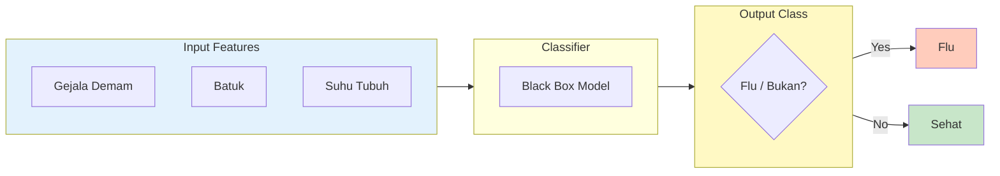
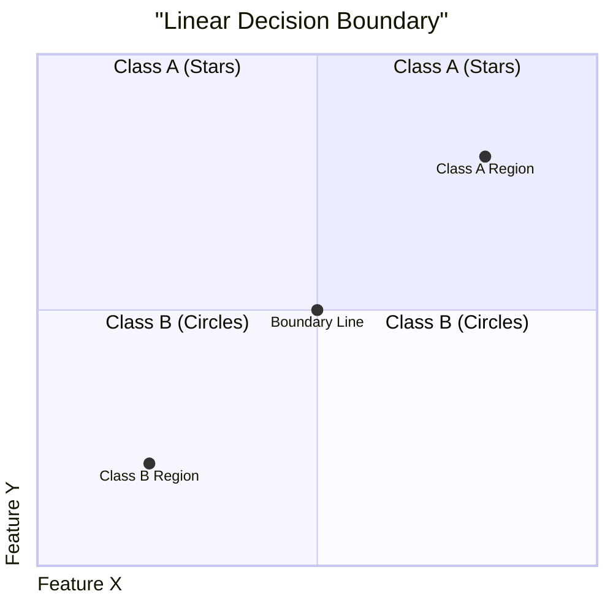
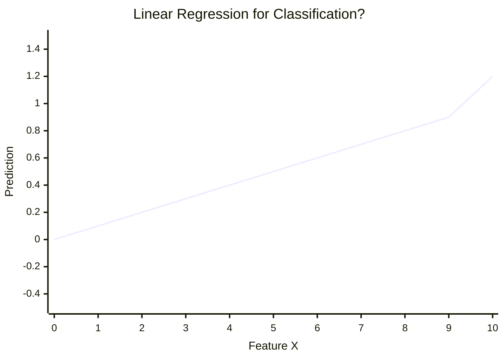
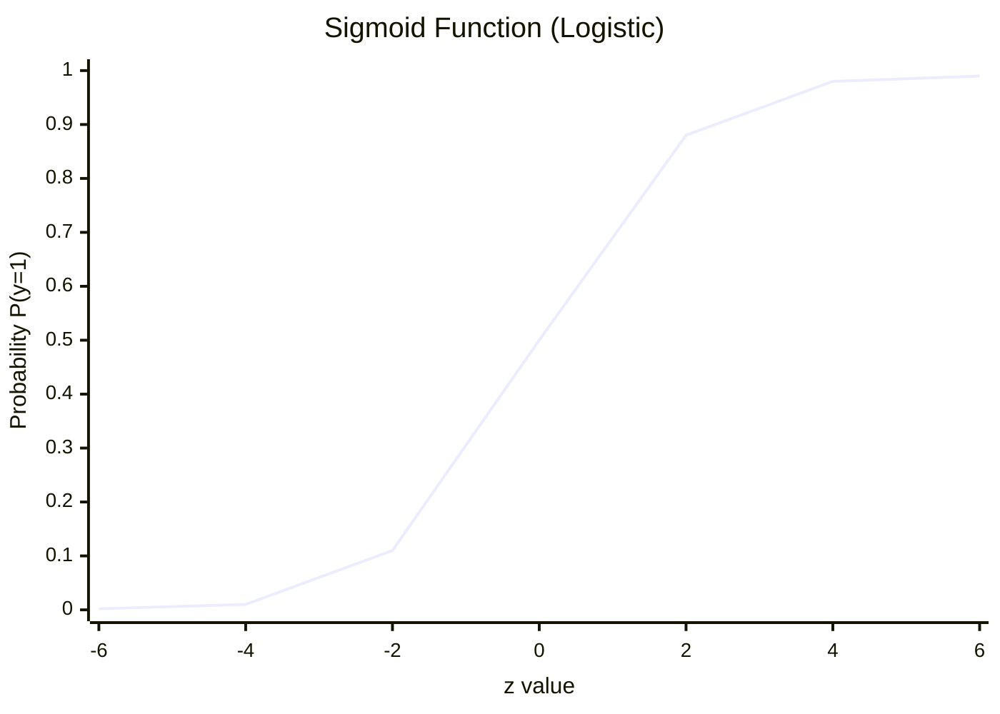
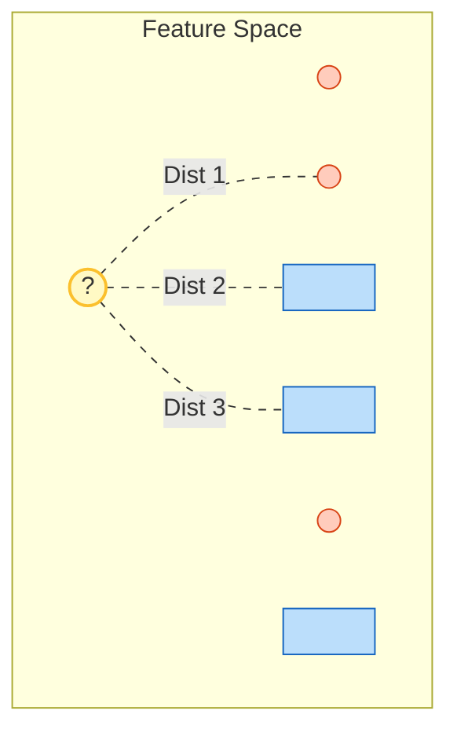
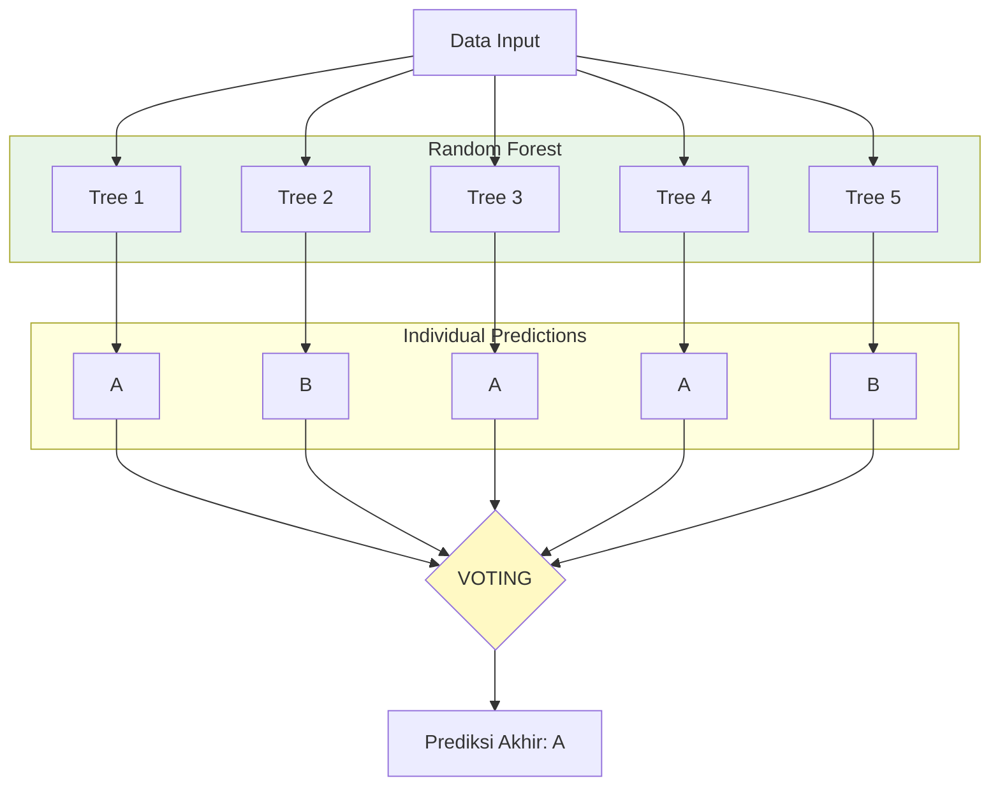
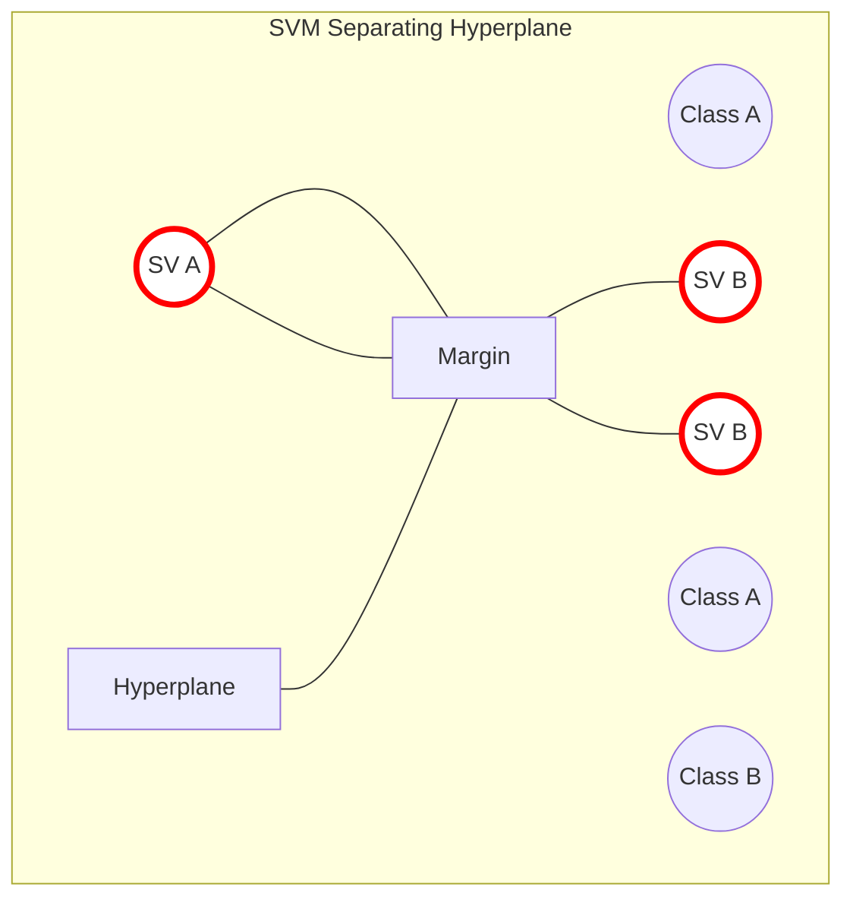
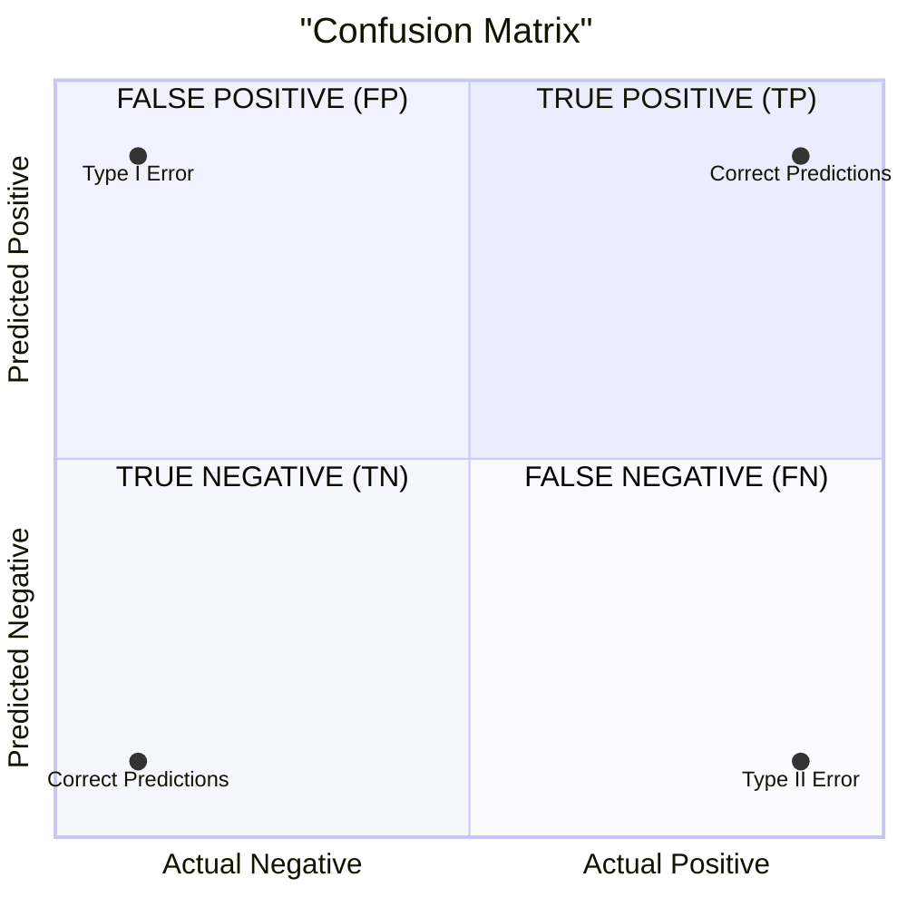
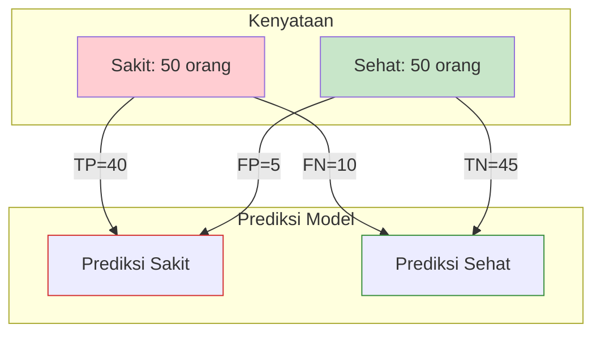

# BAB 6: Algoritma Klasifikasi Dasar

---

## 🎯 Tujuan Pembelajaran

Setelah mempelajari bab ini, Anda akan mampu:

- Memahami konsep klasifikasi dalam machine learning
- Mengimplementasikan Logistic Regression untuk klasifikasi biner
- Menjelaskan dan menerapkan algoritma K-Nearest Neighbors (KNN)
- Memahami Naive Bayes Classifier dan asumsinya
- Membangun Decision Tree dan memahami konsep Random Forest
- Mengenal dasar Support Vector Machine (SVM)
- Membaca dan menginterpretasikan Confusion Matrix
- Menghitung metrik evaluasi: Accuracy, Precision, Recall, F1-Score

---

## 📖 Pendahuluan

Bayangkan dokter yang harus mendiagnosis pasien: apakah pasien menderita diabetes atau tidak? Atau bank yang harus memutuskan: apakah pemohon kredit berisiko tinggi atau rendah? Ini adalah contoh **masalah klasifikasi** — memprediksi kategori/kelas dari suatu data berdasarkan fiturnya.

Klasifikasi adalah salah satu tugas paling umum dalam machine learning. Dalam bab ini, kita akan mempelajari berbagai algoritma klasifikasi dasar yang menjadi fondasi untuk teknik yang lebih kompleks.

---

## 6.1 Konsep Klasifikasi

### 6.1.1 Definisi

**Klasifikasi** adalah proses memprediksi **kelas/kategori** (variabel diskrit) dari suatu observasi berdasarkan fitur-fiturnya.



**Gambar 6.1**: Alur dasar proses klasifikasi. Fitur input diproses untuk memprediksi label kategori (kelas).

### 6.1.2 Jenis Klasifikasi

| Jenis                          | Jumlah Kelas      | Contoh                   |
| ------------------------------ | ----------------- | ------------------------ |
| **Binary Classification**      | 2                 | Spam/Not Spam, Yes/No    |
| **Multi-class Classification** | >2                | Digit (0-9), Jenis bunga |
| **Multi-label Classification** | Multiple per item | Tag artikel, Genre film  |

### 6.1.3 Classifier Boundary

Classifier bekerja dengan membuat **decision boundary** yang memisahkan kelas-kelas berbeda.



_(Visualisasi Konseptual: Garis diagonal memisahkan area Kelas A dan Kelas B berdasarkan nilai fiturnya)._

**Gambar 6.2**: Ilustrasi Decision Boundary (batas keputusan) yang memisahkan dua kelas data.

---

## 6.2 Logistic Regression

### 6.2.1 Mengapa Bukan Linear Regression?

Linear Regression tidak cocok untuk klasifikasi karena:

1. Output tidak terbatas [0, 1]
2. Prediksi bisa negatif atau > 1
3. Tidak merepresentasikan probabilitas



_(Garis lurus linear regression bisa menembus batas probabilitas 0 dan 1 (lihat nilai y di atas 1), membuatnya tidak cocok untuk klasifikasi probabilitas)._

**Gambar 6.3**: Masalah menggunakan Linear Regression untuk klasifikasi. Outputnya tidak terbatas (unbounded).

### 6.2.2 Sigmoid Function

**Logistic Regression** menggunakan **sigmoid function** untuk membatasi output antara 0 dan 1:

$$\sigma(z) = \frac{1}{1 + e^{-z}}$$

Di mana $z = \mathbf{w}^T \mathbf{x} + b$



_(Kurva berbentuk S (Sigmoid) memaksa output selalu berada di antara 0 dan 1, sangat cocok untuk probabilitas)._

**Gambar 6.4**: Fungsi Sigmoid yang memetakan nilai input apa pun ke dalam rentang [0, 1].

### 6.2.3 Model Logistic Regression

$$P(y=1|x) = \sigma(\mathbf{w}^T \mathbf{x} + b) = \frac{1}{1 + e^{-(\mathbf{w}^T \mathbf{x} + b)}}$$

**Prediksi:**

- Jika $P(y=1|x) \geq 0.5$ → Prediksi kelas 1
- Jika $P(y=1|x) < 0.5$ → Prediksi kelas 0

### 6.2.4 Cost Function: Binary Cross-Entropy

$$J(\mathbf{w}) = -\frac{1}{n}\sum_{i=1}^{n}[y_i \log(\hat{y}_i) + (1-y_i)\log(1-\hat{y}_i)]$$

Intuisi:

- Jika $y=1$ dan $\hat{y}$ mendekati 1 → cost rendah ✓
- Jika $y=1$ dan $\hat{y}$ mendekati 0 → cost tinggi ✗
- Jika $y=0$ dan $\hat{y}$ mendekati 0 → cost rendah ✓
- Jika $y=0$ dan $\hat{y}$ mendekati 1 → cost tinggi ✗

### 6.2.5 Contoh Logistic Regression

**Kasus**: Prediksi apakah mahasiswa lulus (1) atau tidak (0) berdasarkan jam belajar.

| Jam Belajar (x) | Lulus (y) |
| --------------- | --------- |
| 1               | 0         |
| 2               | 0         |
| 3               | 0         |
| 4               | 1         |
| 5               | 1         |
| 6               | 1         |

Setelah training, misalkan: $w = 1.5$, $b = -5$

Untuk x = 3.5:
$$z = 1.5 \times 3.5 - 5 = 0.25$$
$$P(lulus) = \sigma(0.25) = \frac{1}{1+e^{-0.25}} \approx 0.56$$

Prediksi: Lulus (karena 0.56 > 0.5)

---

## 6.3 K-Nearest Neighbors (KNN)

### 6.3.1 Konsep Dasar

**K-Nearest Neighbors (KNN)** adalah algoritma yang memprediksi kelas berdasarkan **mayoritas kelas dari k tetangga terdekat**.

> 💡 **Analogi**: Untuk mengetahui siapa Anda, lihat dengan siapa Anda bergaul!

### 6.3.2 Algoritma

```
FUNGSI KNN_Predict(x_baru, k, data_training):
    distances ← []

    UNTUK setiap (x, y) DALAM data_training:
        d ← hitung_jarak(x_baru, x)
        distances.tambah((d, y))

    distances.sort_ascending()  // Urutkan berdasarkan jarak
    k_nearest ← distances[:k]   // Ambil k terdekat

    KEMBALIKAN modus(labels dari k_nearest)  // Voting mayoritas
```

### 6.3.3 Visualisasi



_(Titik baru (?) dikelilingi oleh tetangga terdekat. Jika K=3, kita hitung 3 tetangga terdekat dan lakukan voting mayoritas)._

**Gambar 6.5**: Visualisasi K-Nearest Neighbors (KNN). Klasifikasi ditentukan oleh tetangga terdekat.

### 6.3.4 Fungsi Jarak

| Nama          | Formula                             | Kasus Penggunaan       |
| ------------- | ----------------------------------- | ---------------------- | ---------- | ----------------- |
| **Euclidean** | $\sqrt{\sum(x_i - y_i)^2}$          | Default, fitur kontinu |
| **Manhattan** | $\sum                               | x_i - y_i              | $          | Grid, sparse data |
| **Minkowski** | $(\sum                              | x_i - y_i              | ^p)^{1/p}$ | Generalisasi      |
| **Cosine**    | $1 - \frac{x \cdot y}{\|x\| \|y\|}$ | Text similarity        |

### 6.3.5 Memilih K

| K terlalu kecil   | K terlalu besar    |
| ----------------- | ------------------ |
| Sensitif noise    | Terlalu "smooth"   |
| Overfitting       | Underfitting       |
| Boundary kompleks | Boundary sederhana |

**Tips:**

- K biasanya ganjil (menghindari tie)
- K = √n sebagai starting point
- Gunakan cross-validation untuk memilih K optimal

### 6.3.6 Kelebihan dan Kekurangan

**✅ Kelebihan:**

- Sederhana dan intuitif
- Tidak perlu training (lazy learner)
- Bagus untuk decision boundary yang kompleks

**❌ Kekurangan:**

- Lambat untuk prediksi (hitung jarak ke semua data)
- Sensitif terhadap skala fitur (perlu normalization!)
- Tidak efektif untuk dimensi tinggi (curse of dimensionality)

---

## 6.4 Naive Bayes Classifier

### 6.4.1 Konsep Dasar

**Naive Bayes** adalah classifier berbasis Teorema Bayes dengan asumsi **naive** bahwa semua fitur **independent** satu sama lain.

### 6.4.2 Teorema Bayes

$$P(C|X) = \frac{P(X|C) \cdot P(C)}{P(X)}$$

Di mana:

- $P(C|X)$: Probabilitas kelas C diberikan fitur X (posterior)
- $P(X|C)$: Probabilitas fitur X diberikan kelas C (likelihood)
- $P(C)$: Probabilitas kelas C (prior)
- $P(X)$: Probabilitas fitur X (evidence)

### 6.4.3 Asumsi Naive

Asumsi: Semua fitur independent given class.

$$P(X|C) = P(x_1|C) \cdot P(x_2|C) \cdot ... \cdot P(x_n|C)$$

Sehingga:
$$P(C|X) \propto P(C) \prod_{i=1}^{n} P(x_i|C)$$

### 6.4.4 Contoh: Klasifikasi Spam Email

**Training Data:**

| Email | "free" | "meeting" | "offer" | **Spam?** |
| ----- | ------ | --------- | ------- | --------- |
| 1     | ya     | tidak     | ya      | Ya        |
| 2     | tidak  | ya        | tidak   | Tidak     |
| 3     | ya     | tidak     | ya      | Ya        |
| 4     | tidak  | ya        | tidak   | Tidak     |
| 5     | ya     | ya        | tidak   | Tidak     |

**Hitung Prior:**

- P(Spam) = 2/5 = 0.4
- P(Not Spam) = 3/5 = 0.6

**Hitung Likelihood:**

- P("free"=ya | Spam) = 2/2 = 1.0
- P("free"=ya | Not Spam) = 1/3 = 0.33
- P("meeting"=ya | Spam) = 0/2 = 0 → gunakan Laplace smoothing!
- ... dan seterusnya

**Prediksi email baru:**
Email: "free"=ya, "meeting"=tidak, "offer"=ya

```
P(Spam | email) ∝ P(Spam) × P(free=ya|Spam) × P(meeting=tidak|Spam) × P(offer=ya|Spam)
P(Not Spam | email) ∝ P(Not Spam) × P(free=ya|Not) × P(meeting=tidak|Not) × P(offer=ya|Not)
```

Pilih kelas dengan probabilitas tertinggi!

### 6.4.5 Laplace Smoothing

Untuk menghindari probabilitas 0:
$$P(x_i|C) = \frac{count(x_i, C) + \alpha}{count(C) + \alpha \cdot |V|}$$

Di mana $\alpha = 1$ (Laplace) dan $|V|$ = jumlah kemungkinan nilai.

### 6.4.6 Jenis Naive Bayes

| Jenis              | Fitur                      | Contoh                           |
| ------------------ | -------------------------- | -------------------------------- |
| **Gaussian NB**    | Kontinu, distribusi normal | Ukuran fisik, pengukuran         |
| **Multinomial NB** | Count data                 | Text classification, word counts |
| **Bernoulli NB**   | Binary                     | Ada/tidak ada kata               |

---

## 6.5 Decision Tree

### 6.5.1 Konsep Dasar

**Decision Tree** adalah model yang membuat keputusan berdasarkan serangkaian pertanyaan if-then tentang fitur.

```
                    ┌─────────────────┐
                    │  Cuaca = ?      │
                    └────────┬────────┘
                             │
              ┌──────────────┼──────────────┐
              ▼              ▼              ▼
           [Cerah]       [Berawan]      [Hujan]
              │              │              │
              ▼              ▼              ▼
        ┌─────────┐    ┌─────────┐    ┌──────────┐
        │Kelembab-│    │  MAIN   │    │ Angin =? │
        │an = ?   │    │  ✓      │    └────┬─────┘
        └────┬────┘    └─────────┘         │
             │                       ┌─────┴─────┐
      ┌──────┴──────┐               ▼           ▼
      ▼             ▼           [Kencang]   [Pelan]
   [Tinggi]     [Normal]           │           │
      │             │              ▼           ▼
      ▼             ▼          ┌───────┐  ┌───────┐
   ┌───────┐   ┌───────┐       │ TIDAK │  │ MAIN  │
   │ TIDAK │   │ MAIN  │       │   ✗   │  │  ✓    │
   │   ✗   │   │  ✓    │       └───────┘  └───────┘
   └───────┘   └───────┘
```

### 6.5.2 Terminologi

| Istilah           | Definisi                              |
| ----------------- | ------------------------------------- |
| **Root Node**     | Node paling atas (pertanyaan pertama) |
| **Internal Node** | Node dengan children (pertanyaan)     |
| **Leaf Node**     | Node akhir (keputusan/kelas)          |
| **Branch**        | Koneksi berdasarkan nilai fitur       |
| **Depth**         | Jarak dari root ke leaf               |

### 6.5.3 Bagaimana Memilih Fitur untuk Split?

Goal: Pilih fitur yang **paling informatif** — yang paling memisahkan kelas.

**Entropy:**
$$H(S) = -\sum_{i=1}^{c} p_i \log_2(p_i)$$

- Entropy = 0: Semua data satu kelas (pure)
- Entropy = 1: Data seimbang 50-50 (maximum uncertainty)

**Information Gain:**
$$IG(S, A) = H(S) - \sum_{v \in Values(A)} \frac{|S_v|}{|S|} H(S_v)$$

Pilih fitur dengan Information Gain tertinggi!

### 6.5.4 Contoh Perhitungan

**Data:** 14 hari, 9 hari Main (+), 5 hari Tidak Main (-)

**Entropy awal:**
$$H(S) = -\frac{9}{14}\log_2\frac{9}{14} - \frac{5}{14}\log_2\frac{5}{14} \approx 0.94$$

**Split berdasarkan Cuaca:**

- Cerah: 2+, 3- → $H = 0.97$
- Berawan: 4+, 0- → $H = 0$ (pure!)
- Hujan: 3+, 2- → $H = 0.97$

**Information Gain:**
$$IG = 0.94 - \frac{5}{14}(0.97) - \frac{4}{14}(0) - \frac{5}{14}(0.97) \approx 0.247$$

### 6.5.5 Algoritma ID3/C4.5/CART

| Algoritma | Kriteria Split   | Fitur                 |
| --------- | ---------------- | --------------------- |
| **ID3**   | Information Gain | Kategorikal           |
| **C4.5**  | Gain Ratio       | Kategorikal + Numerik |
| **CART**  | Gini Impurity    | Kategorikal + Numerik |

**Gini Impurity:**
$$Gini(S) = 1 - \sum_{i=1}^{c} p_i^2$$

### 6.5.6 Pruning

Decision Tree cenderung **overfitting**. Solusi: **Pruning** — memotong cabang yang tidak penting.

| Jenis Pruning    | Deskripsi                               |
| ---------------- | --------------------------------------- |
| **Pre-pruning**  | Stop growing sebelum tree terlalu dalam |
| **Post-pruning** | Grow full tree, lalu potong cabang      |

**Hyperparameter untuk pre-pruning:**

- `max_depth`: Kedalaman maksimum
- `min_samples_split`: Minimum sampel untuk split
- `min_samples_leaf`: Minimum sampel di leaf

---

## 6.6 Random Forest

### 6.6.1 Konsep Ensemble

**Ensemble learning** menggabungkan beberapa model untuk menghasilkan prediksi yang lebih baik.

> 💡 **Wisdom of the Crowd**: Rata-rata tebakan banyak orang sering lebih akurat dari satu ahli!

### 6.6.2 Random Forest

**Random Forest** adalah ensemble dari banyak Decision Trees:



**Gambar 6.7**: Arsitektur Random Forest. Menggabungkan prediksi dari banyak pohon (ensemble) melalui voting.

### 6.6.3 Dua Randomization dalam Random Forest

1. **Bootstrap Sampling (Bagging)**
   - Setiap tree dilatih pada subset random dari data
   - Sampling with replacement

2. **Random Feature Selection**
   - Setiap split hanya mempertimbangkan subset random fitur
   - Biasanya √d fitur untuk klasifikasi

### 6.6.4 Kelebihan Random Forest

✅ Mengurangi overfitting dibanding single tree
✅ Robust terhadap noise dan outliers
✅ Bisa mengukur **feature importance**
✅ Parallelizable (setiap tree independent)

---

## 6.7 Support Vector Machine (SVM)

### 6.7.1 Konsep Dasar

**Support Vector Machine (SVM)** mencari **hyperplane** yang memisahkan kelas dengan **margin terbesar**.



_(Support Vectors (garis merah tebal) adalah titik data terdekat yang menopang/menentukan posisi hyperplane)._

**Gambar 6.8**: Konsep Support Vector Machine (SVM). Mencari hyperplane dengan margin terbesar antara dua kelas.

### 6.7.2 Margin dan Support Vectors

- **Margin**: Jarak antara hyperplane dan data terdekat
- **Support Vectors**: Data point yang paling dekat dengan hyperplane
- Goal: Maksimalkan margin

### 6.7.3 Kernel Trick

Untuk data yang tidak linearly separable, SVM menggunakan **kernel** untuk memproyeksikan data ke dimensi lebih tinggi.

**Kernel populer:**

| Kernel             | Formula                         | Kasus                   |
| ------------------ | ------------------------------- | ----------------------- |
| **Linear**         | $K(x,y) = x^T y$                | Data linearly separable |
| **Polynomial**     | $K(x,y) = (x^T y + c)^d$        | Hubungan polynomial     |
| **RBF (Gaussian)** | $K(x,y) = e^{-\gamma\|x-y\|^2}$ | Most common, flexible   |

```
    Data 1D (tidak separable)        Data 2D (separable!)

    ○ ○ ○ ● ● ● ○ ○ ○                     ○   ○   ○
    ─────────────────          →            ╱ ╲
                                       ●  ● ╱   ╲●  ●
                              Transformasi ke dimensi lebih tinggi
```

### 6.7.4 Hyperparameter SVM

| Parameter     | Fungsi                                        |
| ------------- | --------------------------------------------- |
| **C**         | Trade-off antara margin dan misclassification |
| **γ (gamma)** | Seberapa jauh pengaruh satu training point    |
| **kernel**    | Jenis transformasi                            |

---

## 6.8 Evaluasi Classifier

### 6.8.1 Confusion Matrix



**Gambar 6.10**: Struktur Confusion Matrix. Menunjukkan empat kemungkinan hasil prediksi classifier.

### 6.8.2 Contoh Confusion Matrix

**Kasus:** Klasifikasi penyakit



**Gambar 6.11**: Contoh Confusion Matrix untuk diagnosa penyakit. Perhatikan 10 False Negative yang berbahaya (orang sakit diprediksi sehat).

### 6.8.3 Metrik Evaluasi

| Metrik                   | Formula                                                     | Arti                                         |
| ------------------------ | ----------------------------------------------------------- | -------------------------------------------- |
| **Accuracy**             | $\frac{TP + TN}{TP + TN + FP + FN}$                         | Proporsi prediksi yang benar                 |
| **Precision**            | $\frac{TP}{TP + FP}$                                        | Dari prediksi positif, berapa yang benar?    |
| **Recall (Sensitivity)** | $\frac{TP}{TP + FN}$                                        | Dari aktual positif, berapa yang terdeteksi? |
| **Specificity**          | $\frac{TN}{TN + FP}$                                        | Dari aktual negatif, berapa yang terdeteksi? |
| **F1-Score**             | $\frac{2 \cdot Precision \cdot Recall}{Precision + Recall}$ | Harmonic mean precision & recall             |

### 6.8.4 Perhitungan dari Contoh

$$Accuracy = \frac{40 + 45}{100} = 0.85 = 85\%$$

$$Precision = \frac{40}{40 + 5} = 0.89 = 89\%$$

$$Recall = \frac{40}{40 + 10} = 0.80 = 80\%$$

$$F1 = \frac{2 \times 0.89 \times 0.80}{0.89 + 0.80} = 0.84 = 84\%$$

### 6.8.5 Kapan Menggunakan Metrik Mana?

| Situasi             | Metrik Prioritas | Alasan                        |
| ------------------- | ---------------- | ----------------------------- |
| Data seimbang       | Accuracy         | Representatif                 |
| Deteksi spam        | Precision        | Jangan ganggu email penting   |
| Deteksi kanker      | Recall           | Jangan lewatkan pasien sakit! |
| Data tidak seimbang | F1-Score         | Balance precision-recall      |

### 6.8.6 Class Imbalance Problem

Jika 99% data negatif, model yang selalu prediksi negatif punya 99% accuracy tapi tidak berguna!

**Solusi:**

1. **Resampling**: Oversampling minoritas, undersampling mayoritas
2. **SMOTE**: Synthetic Minority Oversampling
3. **Class weights**: Beri bobot lebih pada kelas minoritas
4. **Threshold adjustment**: Turunkan threshold prediksi

---

## 📝 Ringkasan

1. **Klasifikasi**: Memprediksi kategori diskrit dari fitur

2. **Logistic Regression**:
   - Menggunakan sigmoid function
   - Output: probabilitas kelas
   - Binary Cross-Entropy sebagai loss

3. **K-Nearest Neighbors (KNN)**:
   - Prediksi dari voting k tetangga terdekat
   - Lazy learner, sederhana tapi lambat

4. **Naive Bayes**:
   - Berbasis Teorema Bayes
   - Asumsi independence antar fitur
   - Cepat, bagus untuk text classification

5. **Decision Tree**:
   - Serangkaian pertanyaan if-then
   - Information Gain / Gini untuk split
   - Cenderung overfitting → perlu pruning

6. **Random Forest**:
   - Ensemble dari banyak Decision Trees
   - Bagging + random feature selection
   - Lebih robust

7. **SVM**:
   - Mencari hyperplane dengan margin terbesar
   - Kernel trick untuk non-linear data

8. **Evaluasi**:
   - Confusion Matrix: TP, TN, FP, FN
   - Accuracy, Precision, Recall, F1-Score
   - Pilih metrik sesuai konteks!

---

## 📚 Studi Kasus: Deteksi Diabetes

### Problem

Prediksi apakah pasien menderita diabetes berdasarkan data medis.

### Dataset: Pima Indians Diabetes

| Feature       | Description                   |
| ------------- | ----------------------------- |
| Pregnancies   | Jumlah kehamilan              |
| Glucose       | Kadar gula darah              |
| BloodPressure | Tekanan darah                 |
| BMI           | Body Mass Index               |
| Age           | Usia                          |
| **Outcome**   | 0 = No Diabetes, 1 = Diabetes |

### Perbandingan Model

| Model               | Accuracy | Precision | Recall | F1   |
| ------------------- | -------- | --------- | ------ | ---- |
| Logistic Regression | 77%      | 71%       | 58%    | 0.64 |
| KNN (k=5)           | 75%      | 68%       | 55%    | 0.61 |
| Naive Bayes         | 76%      | 70%       | 56%    | 0.62 |
| Decision Tree       | 73%      | 64%       | 58%    | 0.61 |
| Random Forest       | 79%      | 73%       | 61%    | 0.66 |

### Interpretasi

- Random Forest memberikan hasil terbaik
- Recall penting (jangan lewatkan pasien diabetes!)
- Trade-off: meningkatkan recall mungkin menurunkan precision

---

## ✏️ Soal Latihan

### Pilihan Ganda

**1.** Output dari Logistic Regression adalah:

- a) Kelas langsung
- b) Probabilitas antara 0 dan 1
- c) Nilai kontinu tanpa batas
- d) Jarak ke hyperplane

**2.** Dalam KNN, jika K terlalu besar:

- a) Overfitting
- b) Underfitting
- c) Tidak berpengaruh
- d) Error meningkat drastis

**3.** Asumsi "naive" dalam Naive Bayes adalah:

- a) Data berdistribusi normal
- b) Fitur independent satu sama lain
- c) Semua fitur penting sama
- d) Tidak ada missing values

**4.** Random Forest mengurangi overfitting dengan cara:

- a) Menggunakan tree yang lebih dalam
- b) Menggabungkan banyak trees dengan randomization
- c) Menggunakan lebih sedikit fitur
- d) Menggunakan learning rate kecil

**5.** Jika FN (False Negative) sangat berbahaya, metrik yang harus diprioritaskan adalah:

- a) Accuracy
- b) Precision
- c) Recall
- d) Specificity

### Esai Singkat

**6.** Jelaskan mengapa scaling fitur penting untuk KNN tapi tidak untuk Decision Tree.

**7.** Diberikan confusion matrix berikut, hitung Accuracy, Precision, Recall, dan F1:

```
        Predicted
        +    -
Actual + 80   20
       - 30   70
```

**8.** Bandingkan Logistic Regression dan Naive Bayes dari segi asumsi, kelebihan, dan kekurangan.

### Tantangan

**9.** Implementasikan algoritma KNN dalam pseudocode lengkap dengan weighted voting.

**10.** Jelaskan bagaimana kernel RBF di SVM bisa memisahkan data XOR yang tidak linearly separable.

---

## 📖 Glosarium Bab 6

| Istilah                 | Definisi                                             |
| ----------------------- | ---------------------------------------------------- |
| **Klasifikasi**         | Memprediksi kelas/kategori diskrit                   |
| **Logistic Regression** | Klasifikasi dengan sigmoid function                  |
| **Sigmoid**             | Fungsi S-shaped yang memetakan ke [0,1]              |
| **KNN**                 | Klasifikasi berdasarkan k tetangga terdekat          |
| **Naive Bayes**         | Classifier berbasis Bayes dengan asumsi independence |
| **Decision Tree**       | Model dengan struktur if-then bertingkat             |
| **Information Gain**    | Ukuran seberapa informatif suatu fitur               |
| **Gini Impurity**       | Ukuran ketidakmurnian node                           |
| **Random Forest**       | Ensemble dari banyak Decision Trees                  |
| **SVM**                 | Classifier yang mencari margin maksimal              |
| **Kernel**              | Fungsi untuk transformasi ke dimensi lebih tinggi    |
| **Confusion Matrix**    | Tabel prediksi vs aktual                             |
| **Precision**           | TP / (TP + FP)                                       |
| **Recall**              | TP / (TP + FN)                                       |
| **F1-Score**            | Harmonic mean precision dan recall                   |

---

## 📚 Bacaan Lebih Lanjut

1. James, G., et al. (2013). _An Introduction to Statistical Learning_. Springer.
2. Hastie, T., et al. (2009). _The Elements of Statistical Learning_. Springer.
3. Breiman, L. (2001). Random Forests. _Machine Learning_, 45(1), 5-32.
4. Vapnik, V. (1995). _The Nature of Statistical Learning Theory_. Springer.

---

_← [BAB 5: Pengantar Machine Learning](./BAB-05-Pengantar-Machine-Learning.md) | [BAB 7: Algoritma Klastering](./BAB-07-Algoritma-Klastering.md) →_
